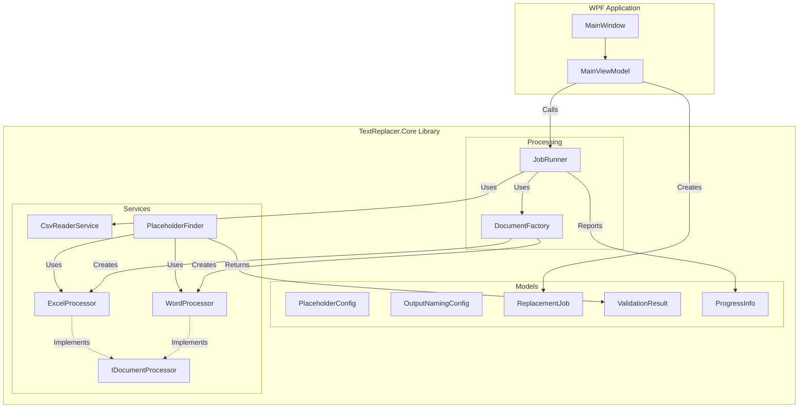
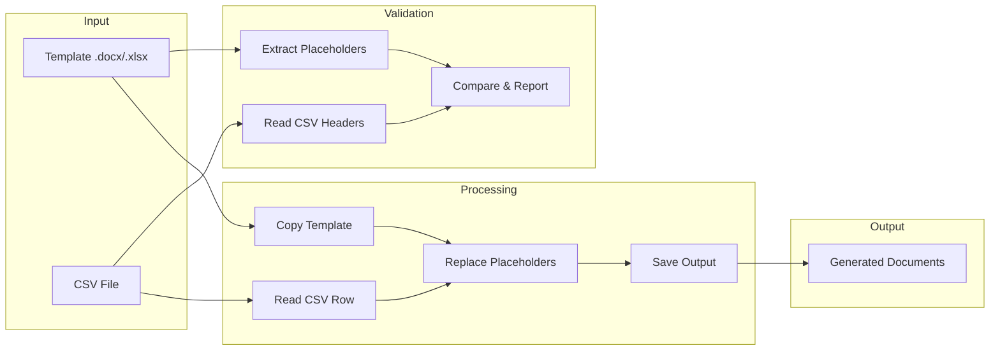
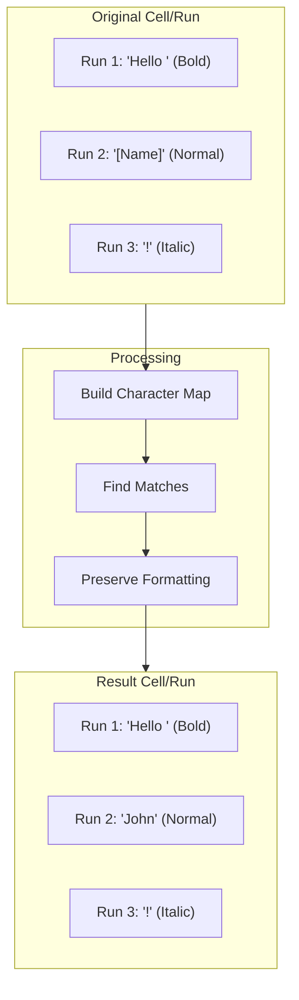
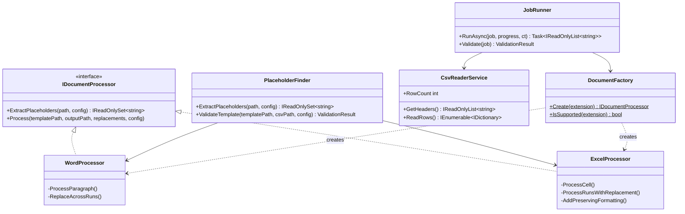
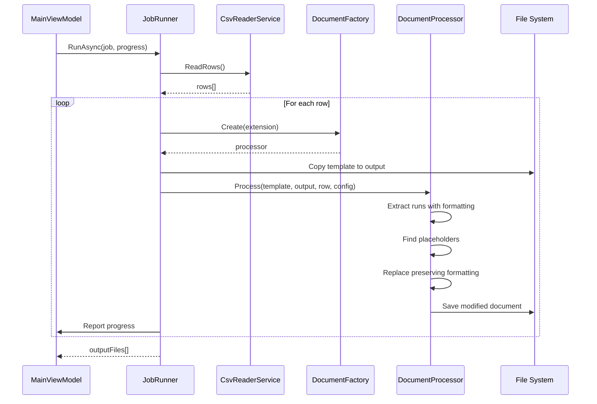

# TextReplacer Architecture

## High-Level Flow

```mermaid
flowchart TB
    subgraph UI["WPF Application"]
        MW[MainWindow]
        VM[MainViewModel]
        MW --> VM
    end

    subgraph Core["TextReplacer.Core Library"]
        subgraph Models
            PC[PlaceholderConfig]
            ONC[OutputNamingConfig]
            RJ[ReplacementJob]
            VR[ValidationResult]
            PI[ProgressInfo]
        end

        subgraph Services
            CSV[CsvReaderService]
            PF[PlaceholderFinder]
            IDP[IDocumentProcessor]
            WP[WordProcessor]
            EP[ExcelProcessor]
        end

        subgraph Processing
            JR[JobRunner]
            DF[DocumentFactory]
        end
    end

    VM -->|Creates| RJ
    VM -->|Calls| JR
    JR -->|Uses| DF
    DF -->|Creates| WP
    DF -->|Creates| EP
    JR -->|Uses| CSV
    JR -->|Reports| PI
    WP -.->|Implements| IDP
    EP -.->|Implements| IDP
    PF -->|Uses| WP
    PF -->|Uses| EP
    PF -->|Returns| VR
```

## Processing Pipeline

```mermaid
flowchart LR
    subgraph Input
        T[Template .docx/.xlsx]
        C[CSV File]
    end

    subgraph Validation
        V1[Extract Placeholders]
        V2[Read CSV Headers]
        V3[Compare & Report]
    end

    subgraph Processing
        P1[Read CSV Row]
        P2[Copy Template]
        P3[Replace Placeholders]
        P4[Save Output]
    end

    subgraph Output
        O[Generated Documents]
    end

    T --> V1
    C --> V2
    V1 --> V3
    V2 --> V3

    C --> P1
    T --> P2
    P1 --> P3
    P2 --> P3
    P3 --> P4
    P4 --> O
```

## Rich Text Formatting Preservation

```mermaid
flowchart TB
    subgraph Original["Original Cell/Run"]
        R1["Run 1: 'Hello ' (Bold)"]
        R2["Run 2: '[Name]' (Normal)"]
        R3["Run 3: '!' (Italic)"]
    end

    subgraph Process["Processing"]
        CM[Build Character Map]
        FM[Find Matches]
        PR[Preserve Formatting]
    end

    subgraph Result["Result Cell/Run"]
        NR1["Run 1: 'Hello ' (Bold)"]
        NR2["Run 2: 'John' (Normal)"]
        NR3["Run 3: '!' (Italic)"]
    end

    Original --> CM
    CM --> FM
    FM --> PR
    PR --> Result
```

## Class Relationships

```mermaid
classDiagram
    class IDocumentProcessor {
        <<interface>>
        +ExtractPlaceholders(path, config) IReadOnlySet~string~
        +Process(templatePath, outputPath, replacements, config)
    }

    class WordProcessor {
        -ProcessParagraph()
        -ReplaceAcrossRuns()
    }

    class ExcelProcessor {
        -ProcessCell()
        -ProcessRunsWithReplacement()
        -AddPreservingFormatting()
    }

    class JobRunner {
        +RunAsync(job, progress, ct) Task~IReadOnlyList~string~~
        +Validate(job) ValidationResult
    }

    class PlaceholderFinder {
        +ExtractPlaceholders(path, config) IReadOnlySet~string~
        +ValidateTemplate(templatePath, csvPath, config) ValidationResult
    }

    class CsvReaderService {
        +GetHeaders() IReadOnlyList~string~
        +ReadRows() IEnumerable~IDictionary~
        +RowCount int
    }

    class DocumentFactory {
        +Create(extension)$ IDocumentProcessor
        +IsSupported(extension)$ bool
    }

    IDocumentProcessor <|.. WordProcessor
    IDocumentProcessor <|.. ExcelProcessor
    JobRunner --> DocumentFactory
    JobRunner --> CsvReaderService
    PlaceholderFinder --> WordProcessor
    PlaceholderFinder --> ExcelProcessor
    DocumentFactory ..> WordProcessor : creates
    DocumentFactory ..> ExcelProcessor : creates
```

## Data Flow for Single Document

```mermaid
sequenceDiagram
    participant UI as MainViewModel
    participant JR as JobRunner
    participant CSV as CsvReaderService
    participant DF as DocumentFactory
    participant DP as DocumentProcessor
    participant FS as File System

    UI->>JR: RunAsync(job, progress)
    JR->>CSV: ReadRows()
    CSV-->>JR: rows[]

    loop For each row
        JR->>DF: Create(extension)
        DF-->>JR: processor
        JR->>FS: Copy template to output
        JR->>DP: Process(template, output, row, config)
        DP->>DP: Extract runs with formatting
        DP->>DP: Find placeholders
        DP->>DP: Replace preserving formatting
        DP->>FS: Save modified document
        JR->>UI: Report progress
    end

    JR-->>UI: outputFiles[]
```
